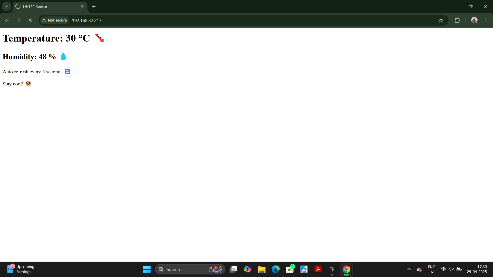

# 🌐 ESP32 Web Server with DHT11 (MicroPython)

This project reads **temperature** and **humidity** data from a **DHT11 sensor** using an **ESP32** board running **MicroPython**, and displays it on a live-updating web page.

---

## 📦 Features

- 🛰️ Connects to Wi-Fi
- 🌡️ Reads real-time temperature & humidity
- 🌐 Hosts a simple web server
- 📱 Mobile + Desktop responsive
- 🔄 Auto-refreshes every 5 seconds
- 💻 Built using MicroPython

---

## 🛠️ Hardware Components

| Component         | Quantity |
|------------------|----------|
| ESP32 Dev Board   | 1        |
| DHT11 Sensor      | 1        |
| Breadboard        | 1        |
| Jumper Wires      | As needed |
| 10KΩ Resistor     | 1 (optional but recommended) |

---

## ⚙️ Circuit Diagram

.png)

> 💡 *10KΩ resistor is connected between VCC and DATA of the DHT11 for stable communication.*

---

## 🌐 Web Interface

The ESP32 serves this HTML interface to any device connected to the same Wi-Fi:

> ✨ Auto-refreshes every 5 seconds with latest sensor data.

---

## 🔌 Wiring Setup

| DHT11 Pin | ESP32 Pin |
|-----------|-----------|
| VCC       | 3.3V      |
| GND       | GND       |
| DATA      | GPIO 4    |

---

## 💡 How It Works

1. ESP32 connects to your Wi-Fi network.
2. It initializes the DHT11 sensor.
3. Every 2 seconds, it reads temperature and humidity.
4. It serves these values on a local web page that refreshes every 5 seconds.

---

## 🧪 Sample Output (Serial Console)
Connected. IP: 192.168.1.42
 Web server running... Client 
 connected from ('192.168.1.17', 50762)

## 🚀 Future Improvements

- 📊 Live charts using JavaScript (Chart.js)
- 📁 Save logs to file or cloud
- 📤 Send alerts via email or Telegram
- 🌎 Deploy to internet using port forwarding

---

## 👨‍💻 Author

- ✍️ Kritish Mohapatra

---

## 📅 Date

- 🗓️ 29 April 2025

---

## ⭐ Like this project?

Give it a ⭐ on GitHub and share with others!